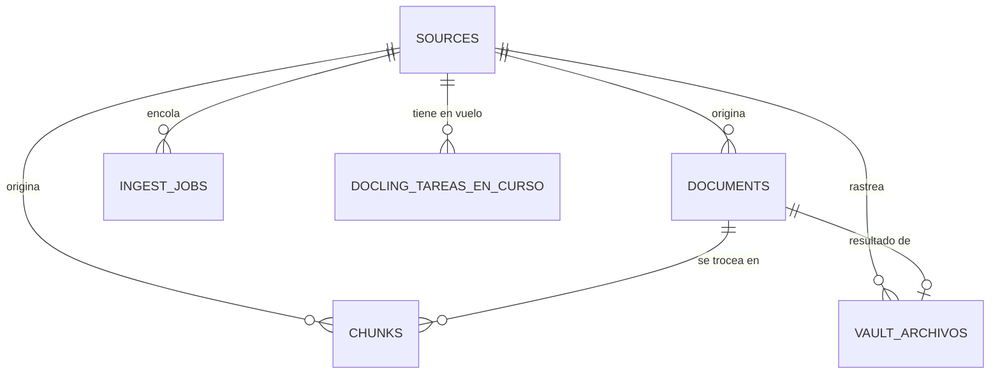

# Modelo de Datos — Base de Conocimiento

## Visión general

PostgreSQL 18 + pgvector. La decisión central del esquema (ver
[ADR-0001](adrs/0001-tabla-unica-de-embeddings.md)): **todas las fuentes caen en la misma
tabla `chunks`** — documentos locales, código, hilos de Teams y work items comparten
columna de embedding, columna FTS e índices, sin migración de datos ni silos por fuente.
El texto crudo nunca entra al espacio vectorial ([ADR-0003](adrs/0003-no-embeber-texto-crudo.md)):
el embedding ancla en los campos que el LLM destiló, el crudo solo alimenta la búsqueda
de texto completo.

## Herramienta de migraciones

- **Herramienta**: Flyway (`spring-boot-flyway` + `flyway-core` + `flyway-database-postgresql`)
- **Ubicación**: `src/main/resources/db/migration/`
- **Flujo**: se aplican automáticamente al arrancar la app (`spring.flyway.enabled: true`
  en `application.yml`) — no hay un paso separado de `flyway:migrate` en CI ni en el
  `Makefile`. Cuatro migraciones hoy: `V1__esquema.sql` (esquema base), `V2__docling_tareas_en_curso.sql`,
  `V3__vault_archivos.sql`, `V4__streams_en_curso.sql`.

## Diagrama entidad-relación

`term_stats`, `query_log` y `streams_en_curso` no tienen FK hacia las tablas de arriba —
son tablas de soporte independientes (ver detalle abajo).

## Tablas

### Core

| Tabla | Propósito | Relaciones clave |
|---|---|---|
| `sources` | Una fila por fuente configurada (`local_docs`, `local_git`, `teams_channel`, `azure_devops`), con `config jsonb`, `project_id` y su propia cadencia de refresco | raíz de `documents`, `chunks`, `ingest_jobs`, `docling_tareas_en_curso`, `vault_archivos` |
| `documents` | La unidad que el usuario reconoce: un archivo, un hilo, un work item. `content_hash` evita re-embeber lo que no cambió | `source_id` → `sources`; 1:N hacia `chunks` |
| `chunks` | **La tabla única de embeddings.** `document_id`, `ord`, `kind`, `text`, `distilled jsonb` (searchable_question, summary, resolution, systems_mentioned, code_references), `embedding vector(1024)`, `fts tsvector` generada. Sin `acl` propia todavía — ver [ADR-0007](adrs/0007-acl-por-fuente-pendiente.md) | `document_id` → `documents`, `source_id` → `sources` |
| `ingest_jobs` | Cola de trabajo en Postgres (sin Redis): el worker toma con `SELECT … FOR UPDATE SKIP LOCKED` | `source_id` → `sources` |

### Soporte de ingesta

| Tabla | Propósito |
|---|---|
| `docling_tareas_en_curso` | Registro de conversiones Docling en vuelo (PK `source_id, external_id`) — sobrevive un reinicio del proceso, ver comentario de `V2__docling_tareas_en_curso.sql` y [ADR-0010](adrs/0010-docling-reemplaza-pdfbox.md) |
| `vault_archivos` | Estado de cada archivo del vault para la consola de administración (F9): `detectado` / `extrayendo` / `procesando` / `error` |

### Reranking / búsqueda

| Tabla | Propósito |
|---|---|
| `term_stats` | Frecuencia documental (`df`, `idf`) del corpus completo — alimenta la señal 3 (supresión por IDF) y el gate de bursting; se recalcula por lote, no en cada consulta |

### Auditoría / operación

| Tabla | Propósito |
|---|---|
| `query_log` | Auditoría permanente de cada consulta: pregunta, plan, herramientas ejecutadas, candidatos, respuesta, citas, latencia |
| `streams_en_curso` | Estado de la última pregunta en curso por conversación (upsert, no bitácora) — permite retomar una respuesta en streaming tras un F5, ver comentario de `V4__streams_en_curso.sql` |

## Índices relevantes

- `chunks_embedding_hnsw_idx` — HNSW `vector_cosine_ops` sobre `embedding` (señal densa)
- `chunks_fts_gin_idx` — GIN sobre `fts` (`spanish`, señal de texto completo)
- `chunks_source_project_idx`, `documents_source_project_idx` — filtrado por
  `(source_id, project_id)` antes de que el planner corra
- `ingest_jobs_pendientes_idx` — índice parcial, solo `status = 'pending'`

## Seguridad a nivel de fila / control de acceso

No hay RLS de Postgres. La segmentación multi-tenant real es `project_id` en cada tabla,
aplicada en la capa de aplicación: cada consulta acota el corpus por `project_id` antes
de que el planner elija herramientas. `documents.acl` existe como columna pero **no se
hace cumplir todavía** — pendiente documentado en [ADR-0007](adrs/0007-acl-por-fuente-pendiente.md).
Los agentes no deben asumir que `acl` filtra nada hoy.

## Docs relacionados

- [`architecture.md`](architecture.md) — pipeline que llena y consulta este esquema
- [`java.md`](java.md) — cómo se accede a estas tablas (`JdbcClient`, sin ORM)
- [`adrs/`](adrs) — decisiones de diseño del esquema
