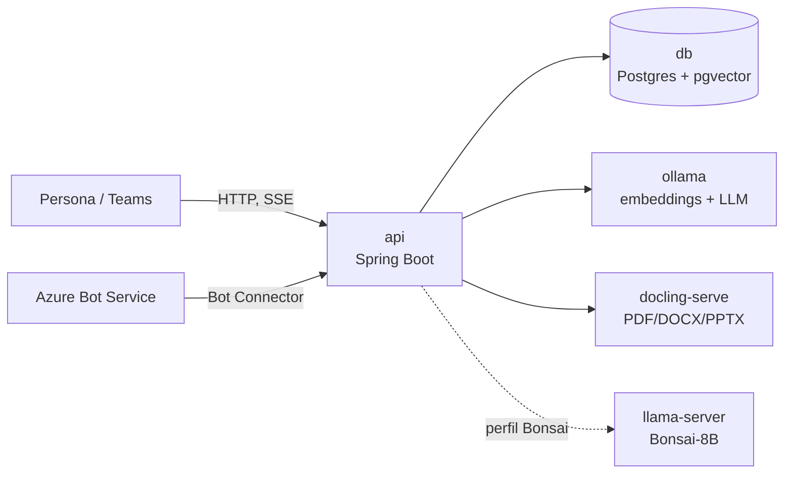

# Infraestructura — Base de Conocimiento

## Desarrollo local

### Prerrequisitos

- Docker Desktop con WSL2 (Windows) — todo corre en contenedores, el build de `api`
  también ocurre dentro de Docker.
- ~15 GB libres en disco (5 GB de modelos + base + imágenes).
- 16 GB de RAM (recomendado 32).
- **Opcional**: GPU NVIDIA con `nvidia-container-toolkit` — detectada automáticamente.
- Java 21 y el wrapper `./mvnw` (ya incluido) solo hacen falta para desarrollar, **no**
  para ejecutar el producto.

### Inicio rápido

```bash
cp .env.example .env
make up                 # levanta db, ollama, docling-serve y api
make pull-models        # ~5 GB, una sola vez (embeddings + reranker)
make health              # confirma que no falta ningún modelo
make seed                 # opcional: puebla con el corpus de ejemplo
```

`make up` detecta una GPU NVIDIA sola (`nvidia-smi`) y aplica `compose.gpu.yml`
automáticamente; el perfil CPU (`compose.yml` solo) es el fallback cuando no hay tarjeta.

### Servicios (local)

| Servicio | Imagen | Puerto (host) | Propósito |
|---|---|---|---|
| `api` | build propio (`Dockerfile`, multi-etapa) | `KB_PORT` (8080) | Ingesta, retrieval, orquestación, UI estática, reranker, endpoint de Teams |
| `db` | `pgvector/pgvector:pg18-trixie` | `POSTGRES_PORT` (55432) | PostgreSQL 18 + pgvector: tabla única de embeddings, FTS, cola de ingesta, auditoría |
| `ollama` | `ollama/ollama:latest` | `OLLAMA_PORT` (11434) | Sirve `bge-m3` (embeddings) y, según perfil de modelo, el LLM (`gemma3:4b`/Ministral) |
| `docling-serve` | `quay.io/docling-project/docling-serve-cpu:latest` | — | Extrae PDF/DOCX/PPTX a Markdown ([ADR-0010](adrs/0010-docling-reemplaza-pdfbox.md)) |

El perfil Bonsai agrega un quinto servicio, `llama-server` (`Dockerfile.bonsai`, fork CUDA
propio) — ver [ADR-0009](adrs/0009-bonsai-8b-integracion-pospuesta.md) y
[Perfiles de modelo en el README](../README.md#perfiles-de-modelo).

### Variables de entorno

- `.env.example` es la lista canónica — cópialo a `.env` y ajusta lo que necesites; todos
  los valores tienen un default razonable.
- Nunca commitees `.env`.
- No hay `application-{profile}.yml`: toda la variación entre entornos pasa por variables
  de entorno con default embebido en `application.yml` (`${VAR:default}`).

## Producción

### Objetivo de despliegue

Self-hosted, un único host con Docker Compose — **sin nube** por diseño (ver README:
"Costo cero: modelos abiertos en contenedores locales"). No hay evidencia en el repo de
un despliegue distinto (sin manifiestos de Kubernetes/Helm, sin Terraform/CDK). "Producción"
y "desarrollo local" comparten la misma topología de Compose; lo que cambia es el
`.env` y, opcionalmente, el perfil de modelo (`make up` / `make up-bonsai` /
`make up-ministral`).

### Topología



Todo lo pesado y persistente cae bajo `KB_DATA_DIR` (`./.data` por defecto, junto al
repo). El contenido a ingerir vive en `KB_VAULT_DIR`, **fuera** del repo, montado de solo
lectura salvo que se habilite la carga desde la consola de administración
(`KB_INGESTA_CARGA_HABILITADA` + `KB_VAULT_MODO=rw`) — ver [ADR-0011](adrs/0011-vault-unificado.md).

### CI/CD

- **Herramienta**: <!-- TODO: verificar — no se encontró `.github/workflows/`, `azure-pipelines*.yml`, `Jenkinsfile` ni `.gitlab-ci.yml` en el repo; no hay pipeline de CI/CD detectado -->
- **Trigger**: manual — `make build` / `make verify` localmente antes de un `git push`.
- **Despliegue**: manual, vía `make up` (o la variante de perfil) en el host de destino;
  no hay automatización de despliegue en el repo.

## Observabilidad

`spring-boot-starter-actuator` expuesto en `/actuator/{health,info,metrics}`
(`management.endpoints.web.exposure.include`), con `show-details: always` en health. Sin
Micrometer con backend externo cableado (sin Prometheus/Grafana/OTel en el repo) — TODO
si se necesita observabilidad más allá de Actuator crudo. `make health` es el chequeo de
humo real: confirma que ningún modelo falta antes de dar por levantado el stack.

## Docs relacionados

- [`architecture.md`](architecture.md) — contenedores y pipeline funcional
- [`java.md`](java.md) — build, empaquetado (jar por capas), Dockerfile
- [`adrs/`](adrs) — decisiones de infraestructura
